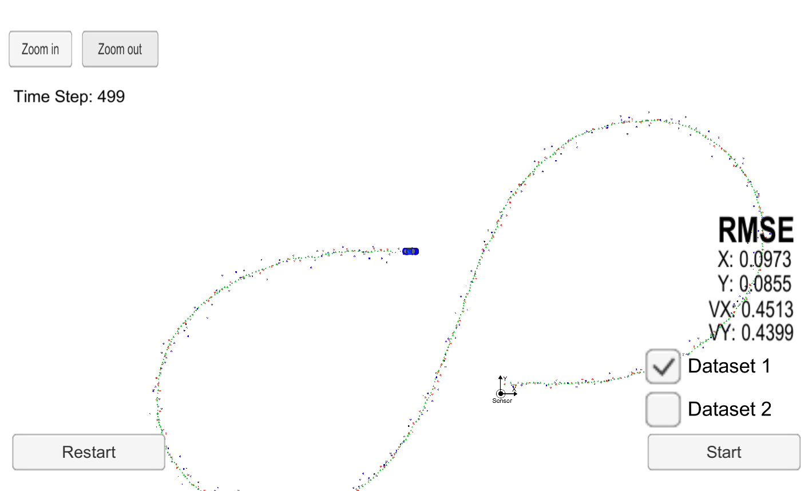
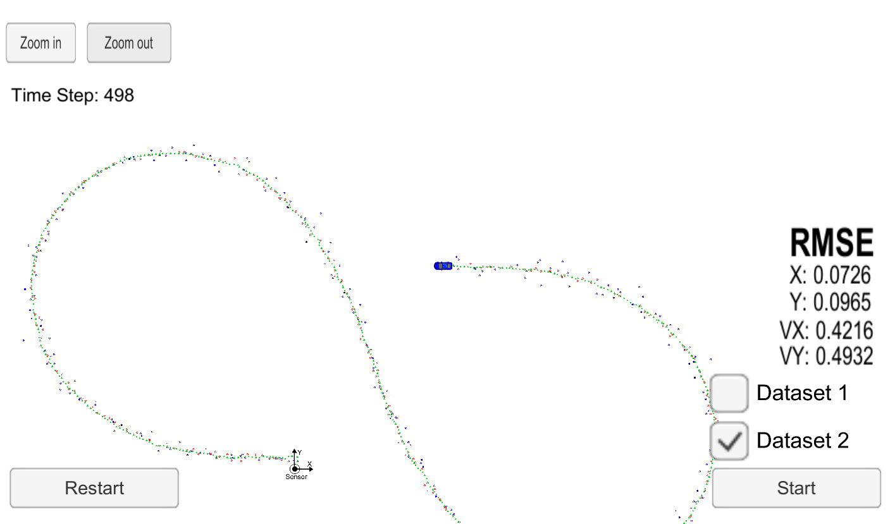

# Extended Kalman filter

The goal of this project is to fuse Lidar and Radar sensor data using a Extended Kalman
filter. The Kalman filter is to be implemented in C++. The kalman filter
executable talks to the term2_simulator via websockets. The simulator provides the radar and
lidar measurements. The Extended Kalman filter should make a good enough
prediction of th position and velocity of the car by fusing the Lidar and Radar
data

## Repository details
-'src/kalman_filter.cpp': Core kalman filter algorithm implementation
-'src/FusionEKF.cpp' : Calls the sensor update and prediction steps

## Results with dataset 1

RMSE: [px,py,vx,vy] = [0.0973,0.0855,0.4513,0.4399]
*Thresold* [.11, .11, 0.52, 0.52]

RMSE: [px,py,vx,vy] = [0.0726,0.0965,0.4216,0.4932]

